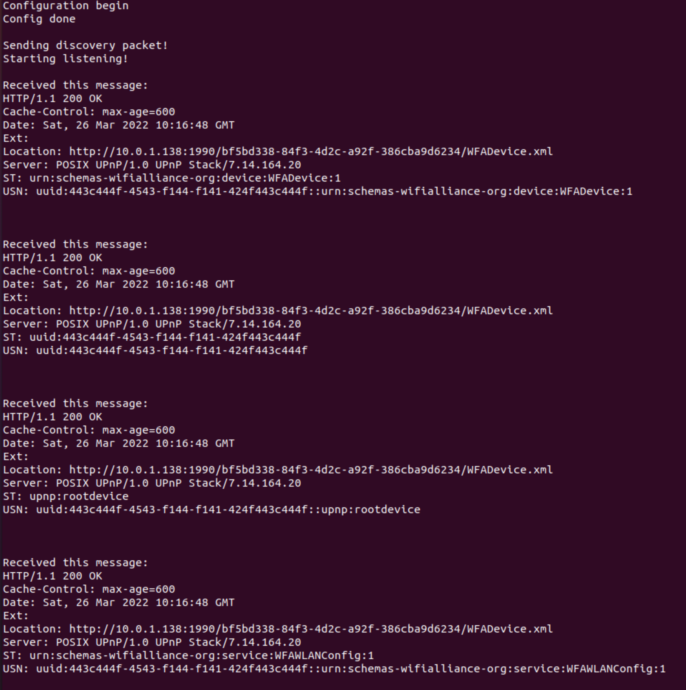
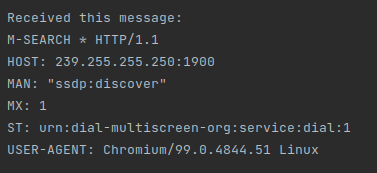
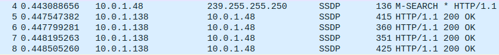

###Description of application

In this directory you can find implementation of the multicast client using SSDP to discover local UPnP devices.

As specified on https://en.wikipedia.org/wiki/Simple_Service_Discovery_Protocol the application connects to multicast group located on 239.255.255.250:1900. And after successful group connection the application sends a discovery message. The message looks like this:

```
M-SEARCH * HTTP/1.1\r\n
HOST: 239.255.255.250:1900\r\n
MAN: \"ssdp:discover\"\r\n
MX: 2\r\n
ST: ssdp:all\r\n\r\n
```

After initial message the application starts listening for other local device responses and on receive writes it into the console. After specified number of second the application stops the listening.

During testing of my application I received these responses:



And I also received discover packets from other local devices:



View of SSDP packets in wireshark:




###Build and Execution

To compile this application you only need functional **cmake**.
Needed commands to compile this application in the root folder look like this:

```
cmake .
make
```


New binary executable named **task1** should appear in the root folder. Then after successful compilation you can execute this application like this:

```
./task1 0.0.0.0 100
```

Where first argument is address of your computer and the second one is maximum time of device listening.