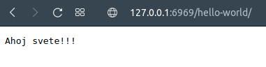

##Popis aplikace

Jedná se o jednoduchý HTTP server, který dokáže obsluhovat HTTP GET požadavky. 
Ty jsou zpracovávány stanovenou množinou vláken, které přijaté požadavky ověřují a pokud je validní odešlou základní HTTP odpověd.
Pokud je zpráva nevalidní, tak je spojení s uživatelem ustřiženo.
V případě, že požadovaný endpoint neexistuje, je navrácen chybový kód 404.
Server navrací hodnoty na několika definovaných endpointech. Mezi ně patří následující:

```
/
/hello-world/
/end-points/
/info/
/xxx/
```

Odpovědi nabývají textové podoby. Při přístupu na endpoint "/hello-world/" z libovolného prohlížeče můžeme očekávat následující pohled:



##Sestavení a spuštění

Pro sestavení aplikace je potřeba pouze funkční **cmake**.
K sestavení aplikace je potřeba pouze těchto příkazů:
```
cmake .
make
```


Nová spustitelná verze aplikace by se měla objevit v root adresáři pod náznem **task2**
Po úspěšné kompilaci stačí spustit následujím způsobem:

```
./task1 127.0.0.1 6969
```


## Testování aplikace

Pro účely testování aplikace bylo využito kromě běžného prohlížeče i prográmku 'netcat'.

Bylo připraveno několik možných i nevalidních zpráv (složka ./tests/), které byly zaslány serveru následujícími způsoby:


```
cat tests/helloWorld.txt | nc 127.0.0.1 6969

cat tests/wrongGet1.txt | nc 127.0.0.1 6969

cat tests/nonExistent.txt | nc 127.0.0.1 6969
```

Při žádném z těchto případů nedošlo k pádu aplikace a vždy byl navrácen očekávaný výstup.