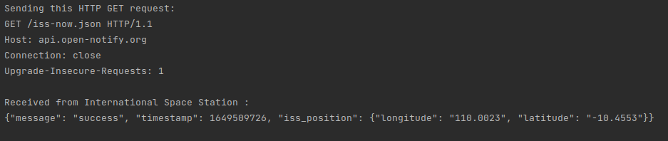
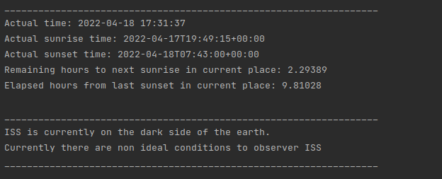
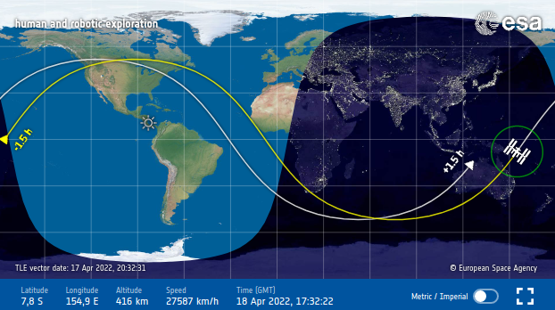
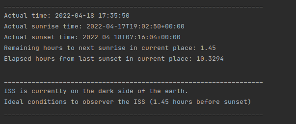
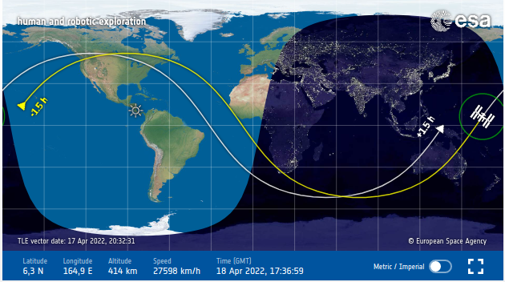

## Popis aplikace

Jedná se o jednoduchou klientskou HTTP REST aplikaci, která sbírá data ze tří veřejně dostupných REST API serverů (dále v sekci: [API](#api)).
Pomocí těchto získaných dat z těchto serverů určí zda se vesmírná stanice momentálně nachází na osvětlené straně země a nebo naopak. 
Také určuje zda je stanice v ideální pozici na sledování (tzn. cca 2-1 hodin před svítáním nebo 1-2 hodin po svítání)


## <a name="api"></a>Seznam použitých API serverů

ISS Now API:
http://open-notify.org/Open-Notify-API/ISS-Location-Now/

Sunrise/Sunset API:
http://open-notify.org/Open-Notify-API/ISS-Location-Now/

Unix Time API:
https://unixtime.co.za/

Odpovědi z těchto API serverů nabývají JSON podoby.
Data jsou standardně získávány pomocí HTTP GET.
Samotný požadavek a odpověd od ISS Now API je ke spatření na následujícím obrázku.



## Sestavení a spuštění

Pro sestavení aplikace je potřeba pouze funkční **cmake**.
K sestavení aplikace je potřeba pouze těchto příkazů:
```
cmake .
make
```


Nová spustitelná verze aplikace by se měla objevit v root adresáři pod náznem **task2**
Po úspěšné kompilaci aplikaci stačí spustit následujím způsobem:

```
./task1 127.0.0.1 6969
```


## Testování aplikace

Pro otestování funkčnosti byla aplikace spouštěna po pěti minutových intervalech a výsledné stanovení polohy bylo porovnáváno podle webové stránky https://spotthestation.nasa.gov/tracking_map.cfm.
Po menších změnách (hlavně v oblasti výpočtů časových rozdílů) začala aplikace fungovat podle očekávání.

Příklad testování:





Příklad 2

