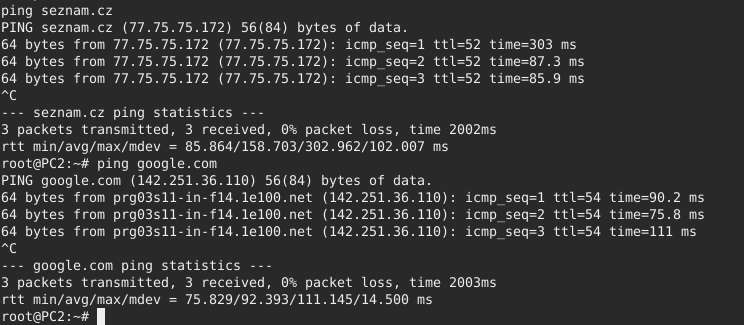

### Zadání
Proveďte nastavení „malé domácí“ sítě připojené do Internetu přes dva
směrovače a NAT podle uvedeného schématu v simulátoru GNS3. Použijte
uvedený adresní prostor, který rozdělíte na dvě podsítě podle doporučení ve
schématu.


### Řešení

V zadání je stanoveno, že by náš směrovač měl obsluhovat 20 hostů/zařízení.
Jelikož je však nejbližším násobkem dvojky číslo 32, bude náš směrovač schopen obsloužit 30 zařízení (-2 gateway a broadcast).
Tudíž výsledná maska vypadá následovně:
````
255.255.255.224
````


#### Nastavení směrovače R2

###### Přiřazení IP addresy k rozhraní gigabitEthernet 1/0 pro zachytávání dat od hostů v síti. 

````
config term
interface gigabitEthernet 1/0
ip address 10.10.2.2 255.255.255.224
no shutdown
end
````


###### Nastavení DHCP pro přiřazování IP address hostům/zařízením a stanovení IP standardního DNS serveru
````
config term
ip dhcp pool home
network 10.10.2.0 255.255.255.224
default-router 10.10.2.2
dns-server 8.8.8.8 4.4.4.4
end
````

###### Nastavení druhého rozhraní směřující ke směrovači R1
````
config term
interface gigabitEthernet 0/0
ip address 192.168.1.2 255.255.255.252
no shutdown
end
````

###### Nastavení RIP pro účely dynamického směrování

````
config term 
router rip 
version 2
network 10.10.2.0
network 192.168.1.0
end
````

Pokud došlo k úspěšnému nastavení protokolu RIP, měly by se do sítě posílat následující pakety.


#### Nastavení směrovače R1

###### Nastavení rozhraní směřující ke směrovači R2

````
config term
interface gigabitEthernet 1/0
ip address 192.168.1.1 255.255.255.252
no shutdown
end
````
###### Nastavení protokolu RIP pro odpovídání na jeho zprávy

````
config term
router rip
version 2
network 192.168.1.0
end
````

###### Získání IP adresy od poskytovatele internetového připojení

````
config term
interface gigabitEthernet 0/0
ip address dhcp
no shutdown
end
````

###### Nastavení NAT pro připojení do veřejného internetu

````
config term
access-list 100 permit ip 192.168.1.0 0.0.0.3 any
access-list 100 permit ip 10.10.2.0 0.0.0.31 any
interface gigabitEthernet 1/0
ip nat inside
interface gigabitEthernet 0/0
ip nat outside
ip nat inside source list 100 interface GigabitEthernet0/0 overload
end
````

#### Uložení nastavení 
Pro oba směrovače by se měl po zadání všech příkazů spusti i následující příkaz, který uloží konfiguraci na disk a při dalším spuštění nebude třeba tyto příkazy zadávat znova.

````
copy running-config startup-config
````

#### Povolení internetového rozhraní na PC zařízeních
Jelikož jsou images konečných zařízení v GNS3 nastaveny tak, aby nebyly standardně připojeny k internetu,
je potřeba odkomentovat poslední řádky z konfigurace. Ty vypadají následovně:


#### Výsledek

Pokud proběhly všechny příkazy úspěšně, mělo by být možné použít ping pro jakoukoliv adresu a i pro doménové jména.
Použití příkazu ping vypadá na prvním počítači následovně:


A na druhém zase následovně:




